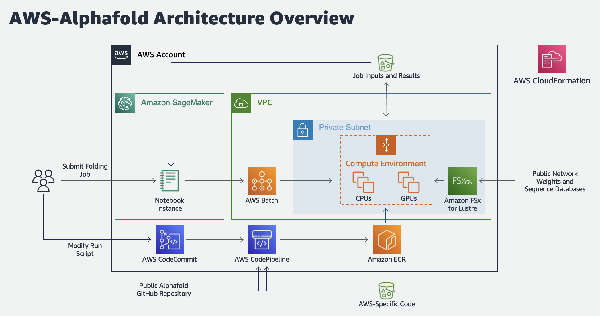

# AWS Batch Architecture for AlphaFold 
-----
## Overview
Proteins are large biomolecules that play an important role in the body. Knowing the physical structure of proteins is key to understanding their function. However, it can be difficult and expensive to determine the structure of many proteins experimentally. One alternative is to predict these structures using machine learning algorithms. Several high-profile research teams have released such algorithms, including [AlphaFold 2](https://deepmind.com/blog/article/alphafold-a-solution-to-a-50-year-old-grand-challenge-in-biology),  [RoseTTAFold](https://www.ipd.uw.edu/2021/07/rosettafold-accurate-protein-structure-prediction-accessible-to-all/), and others. Their work was important enough for Science magazine to name it the ["2021 Breakthrough of the Year"](https://www.science.org/content/article/breakthrough-2021).

Both AlphaFold 2 and RoseTTAFold use a multi-track transformer architecture trained on known protein templates to predict the structure of unknown peptide sequences. These predictions are heavily GPU-dependent and take anywhere from minutes to days to complete. The input features for these predictions include multiple sequence alignment (MSA) data. MSA algorithms are CPU-dependent and can themselves require several hours of processing time.

Running both the MSA and structure prediction steps in the same computing environment can be cost inefficient, because the expensive GPU resources required for the prediction sit unused while the MSA step runs. Instead, using a high-performance computing (HPC) service like [AWS Batch](https://aws.amazon.com/batch/) allows us to run each step as a containerized job with the best fit of CPU, memory, and GPU resources.

This repository includes the CloudFormation template, Jupyter Notebook, and supporting code to run the Alphafold v2.0 algorithm on AWS Batch. 

-----
## Architecture Diagram


-----
## First time setup
### Deploy the infrastructure stack

1. Choose *Launch Stack*:

    [](https://console.aws.amazon.com/cloudformation/home#/stacks/create/review?templateURL=https://aws-hcls-ml.s3.amazonaws.com/blog_post_support_materials/aws-alphafold/cfn.yaml)

2. Specify the following required parameters:
  - For *Stack Name*, enter a value unique to your account and region.
  - For *StackAvailabilityZone* choose an availability zone.
3. If needed, specify the following optional parameters:
  - Select a different value for *AlphaFoldVersion* if you want to include another version of the public Alphafold repo in your Batch job container.
  - Specify a different value for *CodeRepoBucket* and *CodeRepoKey* if you want to populate your AWS-Alphafold CodeCommit repository with custom code stored in another S3 bucket.
  - Select a different value for *FSXForLustreStorageCapacity* if you want to provision a larger file system. The default value of 1200 GB is sufficient to store compressed instances of the Alphafold parameters, BFD (small and reduced), Mgnify, PDB70, PDB mmCIF, Uniclust30, Uniref90, UniProt, and PDB SeqRes datasets.
  - Select a different value for for *FSxForLustreThroughput* if you have unique performance needs. The default is 500 MB/s/TB. Select a higher value for performance-sensitive workloads and a lower value for cost-sensitive workloads.
  - Select Y for *LaunchSageMakerNotebook* if you want to launch a managed sagemaker notebook instance to quickly run the provided Jupyter notebook.

4. Select *I acknowledge that AWS CloudFormation might create IAM resources with custom names*.
5. Choose *Create stack*.
6. Wait 30 minutes for AWS CloudFormation to create the infrastructure stack and AWS CodeBuild to build and publish the AWS-AlphaFold container to Amazon Elastic Container Registry (Amazon ECR).

### Launch SageMaker Notebook
(If *LaunchSageMakerNotebook* set to Y)
1. Navigate to [SageMaker](https://console.aws.amazon.com/codesuite/sagemaker)
2. Select *Notebook* > *Notebook instances*.
3. Select the *AWS-Alphafold-Notebook* instance and then *Actions* > *Open Jupyter* or *Open JupyterLab*.


### Clone Notebook Repository
(If *LaunchSageMakerNotebook* set to F)
1. Navigate to [CodeCommit](https://console.aws.amazon.com/codesuite/codecommit).
2. Select the aws-alphafold repository that was just created and copy the clone URL.
3. Use the URL to clone the repository into your Jupyter notebook environment of choice, such as SageMaker Studio.

### Populate FSx for Lustre File System
1. Once the CloudFormation stack is in a CREATE_COMPLETE status, you can begin populating the FSx for Lustre file system with the necessary sequence databases. To do this automatically, run the following commands at the terminal of your notebook environment:

```
pip install -r notebooks/notebook-requirements.txt
python notebooks/download_ref_data.py <STACK NAME>
```

Replacing `<STACK NAME>` with the name of your cloudformation stack. By default, this will download the "reduced_dbs" version of bfd. You can download the entire database instead by specifying the --download_mode full_dbs option.

2. It will take several hours to populate the file system. You can track its progress by navigating to the file system in the FSx for Lustre console.

The `download_all_data.sh` script will also download the model parameter files. Once the script has finished, you should have the following directory structure:

```
$DOWNLOAD_DIR/                             # Total: ~ 2.2 TB (download: 438 GB)
    bfd/                                   # ~ 1.7 TB (download: 271.6 GB)
        # 6 files.
    mgnify/                                # ~ 64 GB (download: 32.9 GB)
        mgy_clusters_2018_12.fa
    params/                                # ~ 3.5 GB (download: 3.5 GB)
        # 5 CASP14 models,
        # 5 pTM models,
        # 5 AlphaFold-Multimer models,
        # LICENSE,
        # = 16 files.
    pdb70/                                 # ~ 56 GB (download: 19.5 GB)
        # 9 files.
    pdb_mmcif/                             # ~ 206 GB (download: 46 GB)
        mmcif_files/
            # About 180,000 .cif files.
        obsolete.dat
    pdb_seqres/                            # ~ 0.2 GB (download: 0.2 GB)
        pdb_seqres.txt
    small_bfd/                             # ~ 17 GB (download: 9.6 GB)
        bfd-first_non_consensus_sequences.fasta
    uniclust30/                            # ~ 86 GB (download: 24.9 GB)
        uniclust30_2018_08/
            # 13 files.
    uniprot/                               # ~ 98.3 GB (download: 49 GB)
        uniprot.fasta
    uniref90/                              # ~ 58 GB (download: 29.7 GB)
        uniref90.fasta
```

`bfd/` is only downloaded if you download the full databases, and `small_bfd/` is only downloaded if you download the reduced databases.

-----
## Usage
Use the provided `AWS-AlphaFold.ipynb` notebook to submit sequences for analysis and download the results.

-----
## Model parameters

While the AlphaFold code is licensed under the Apache 2.0 License, the AlphaFold parameters are made available under the terms of the CC BY 4.0 license. Please see the [Disclaimer](#license-and-disclaimer) below for more detail.

The AlphaFold parameters are available from https://storage.googleapis.com/alphafold/alphafold_params_2022-01-19.tar, and
are downloaded as part of the `scripts/download_all_data.sh` script. This script will download parameters for:

- Five models which were used during CASP14, and were extensively validated for structure prediction quality (see Jumper et al. 2021, Suppl. Methods 1.12 for details).
- Five pTM models, which were fine-tuned to produce pTM (predicted TM-score) and (PAE) predicted aligned error values alongside their structure predictions (see Jumper et al. 2021, Suppl. Methods 1.9.7 for details).
- Five AlphaFold-Multimer models that produce pTM and PAE values alongside their structure predictions.

-----
## AlphaFold output

AWS Batch will save all job outputs to the S3 bucket specified in the task definition. This includes the computed MSAs, unrelaxed structures, relaxed structures, ranked structures, raw model outputs, prediction metadata, and section timings.
The output directory will have the following structure:

```
<job_name>/
    features.pkl
    ranked_{0,1,2,3,4}.pdb
    ranking_debug.json
    relaxed_model_{1,2,3,4,5}.pdb
    result_model_{1,2,3,4,5}.pkl
    timings.json
    unrelaxed_model_{1,2,3,4,5}.pdb
    msas/
        bfd_uniclust_hits.a3m
        mgnify_hits.sto
        uniref90_hits.sto
```

The contents of each output file are as follows:

- `features.pkl` – A `pickle` file containing the input feature NumPy arrays used by the models to produce the structures.
- `unrelaxed_model_*.pdb` – A PDB format text file containing the predicted structure, exactly as outputted by the model.
- `relaxed_model_*.pdb` – A PDB format text file containing the predicted structure, after performing an Amber relaxation procedure on the unrelaxed structure prediction (see Jumper et al. 2021, Suppl. Methods 1.8.6 for details).
- `ranked_*.pdb` – A PDB format text file containing the relaxed predicted structures, after reordering by model confidence. Here `ranked_0.pdb` should contain the prediction with the highest confidence, and `ranked_4.pdb` the prediction with the lowest confidence. To rank model confidence, we use predicted LDDT (pLDDT) scores (see Jumper et al. 2021, Suppl. Methods 1.9.6 for details).
- `ranking_debug.json` – A JSON format text file containing the pLDDT values used to perform the model ranking, and a mapping back to the original model names.
- `timings.json` – A JSON format text file containing the times taken to run each section of the AlphaFold pipeline.
- `msas/` - A directory containing the files describing the various genetic tool hits that were used to construct the input MSA.
- `result_model_*.pkl` – A `pickle` file containing a nested dictionary of the various NumPy arrays directly produced by the model. In addition to the output of the structure module, this includes auxiliary outputs such as:

  - Distograms (`distogram/logits` contains a NumPy array of shape [N_res, N_res, N_bins] and `distogram/bin_edges` contains the definition of the bins).
  - Per-residue pLDDT scores (`plddt` contains a NumPy array of shape [N_res] with the range of possible values from `0` to `100`, where `100` means most confident). This can serve to identify sequence regions predicted with high confidence or as an overall per-target confidence score when averaged across residues.
  - Present only if using pTM models: predicted TM-score (`ptm` field contains a scalar). As a predictor of a global superposition metric, this score is designed to also assess whether the model is confident in the overall domain packing.
  - Present only if using pTM models: predicted pairwise aligned errors (`predicted_aligned_error` contains a NumPy array of shape [N_res, N_res] with the range of possible values from `0` to `max_predicted_aligned_error`, where `0` means most confident). This can serve for a visualisation of domain packing confidence withi the structure.

The pLDDT confidence measure is stored in the B-factor field of the output PDB files (although unlike a B-factor, higher pLDDT is better, so care must be taken when using for tasks such as molecular replacement).

-----
## Acknowledgements

AlphaFold communicates with and/or references the following separate libraries
and packages:

*   [Abseil](https://github.com/abseil/abseil-py)
*   [Biopython](https://biopython.org)
*   [Chex](https://github.com/deepmind/chex)
*   [Colab](https://research.google.com/colaboratory/)
*   [Docker](https://www.docker.com)
*   [HH Suite](https://github.com/soedinglab/hh-suite)
*   [HMMER Suite](http://eddylab.org/software/hmmer)
*   [Haiku](https://github.com/deepmind/dm-haiku)
*   [Immutabledict](https://github.com/corenting/immutabledict)
*   [JAX](https://github.com/google/jax/)
*   [Kalign](https://msa.sbc.su.se/cgi-bin/msa.cgi)
*   [matplotlib](https://matplotlib.org/)
*   [ML Collections](https://github.com/google/ml_collections)
*   [NumPy](https://numpy.org)
*   [OpenMM](https://github.com/openmm/openmm)
*   [OpenStructure](https://openstructure.org)
*   [pandas](https://pandas.pydata.org/)
*   [pymol3d](https://github.com/avirshup/py3dmol)
*   [SciPy](https://scipy.org)
*   [Sonnet](https://github.com/deepmind/sonnet)
*   [TensorFlow](https://github.com/tensorflow/tensorflow)
*   [Tree](https://github.com/deepmind/tree)
*   [tqdm](https://github.com/tqdm/tqdm)

We thank all their contributors and maintainers!

## License and Disclaimer

### AlphaFold Code License

Licensed under the Apache License, Version 2.0 (the "License"); you may not use
this file except in compliance with the License. You may obtain a copy of the
License at https://www.apache.org/licenses/LICENSE-2.0.

Unless required by applicable law or agreed to in writing, software distributed
under the License is distributed on an "AS IS" BASIS, WITHOUT WARRANTIES OR
CONDITIONS OF ANY KIND, either express or implied. See the License for the
specific language governing permissions and limitations under the License.

### Model Parameters License

The AlphaFold parameters are made available under the terms of the Creative
Commons Attribution 4.0 International (CC BY 4.0) license. You can find details
at: https://creativecommons.org/licenses/by/4.0/legalcode

### Third-party software

Use of the third-party software, libraries or code referred to in the
[Acknowledgements](#acknowledgements) section above may be governed by separate
terms and conditions or license provisions. Your use of the third-party
software, libraries or code is subject to any such terms and you should check
that you can comply with any applicable restrictions or terms and conditions
before use.

### Mirrored Databases

The following databases have been mirrored by DeepMind, and are available with reference to the following:

*   [BFD](https://bfd.mmseqs.com/) (unmodified), by Steinegger M. and Söding J., available under a [Creative Commons Attribution-ShareAlike 4.0 International License](http://creativecommons.org/licenses/by-sa/4.0/).

*   [BFD](https://bfd.mmseqs.com/) (modified), by Steinegger M. and Söding J., modified by DeepMind, available under a [Creative Commons Attribution-ShareAlike 4.0 International License](http://creativecommons.org/licenses/by-sa/4.0/). See the Methods section of the [AlphaFold proteome paper](https://www.nature.com/articles/s41586-021-03828-1) for details.

*   [Uniclust30: v2018_08](http://wwwuser.gwdg.de/~compbiol/uniclust/2018_08/) (unmodified), by Mirdita M. et al., available under a [Creative Commons Attribution-ShareAlike 4.0 International License](http://creativecommons.org/licenses/by-sa/4.0/).

*   [MGnify: v2018_12](http://ftp.ebi.ac.uk/pub/databases/metagenomics/peptide_database/current_release/README.txt) (unmodified), by Mitchell AL et al., available free of all copyright restrictions and made fully and freely available for both non-commercial and commercial use under [CC0 1.0 Universal (CC0 1.0) Public Domain Dedication](https://creativecommons.org/publicdomain/zero/1.0/).

### Citations
The original AlphaFold 2 paper is
```
@Article{AlphaFold2021,
  author  = {Jumper, John and Evans, Richard and Pritzel, Alexander and Green, Tim and Figurnov, Michael and Ronneberger, Olaf and Tunyasuvunakool, Kathryn and Bates, Russ and {\v{Z}}{\'\i}dek, Augustin and Potapenko, Anna and Bridgland, Alex and Meyer, Clemens and Kohl, Simon A A and Ballard, Andrew J and Cowie, Andrew and Romera-Paredes, Bernardino and Nikolov, Stanislav and Jain, Rishub and Adler, Jonas and Back, Trevor and Petersen, Stig and Reiman, David and Clancy, Ellen and Zielinski, Michal and Steinegger, Martin and Pacholska, Michalina and Berghammer, Tamas and Bodenstein, Sebastian and Silver, David and Vinyals, Oriol and Senior, Andrew W and Kavukcuoglu, Koray and Kohli, Pushmeet and Hassabis, Demis},
  journal = {Nature},
  title   = {Highly accurate protein structure prediction with {AlphaFold}},
  year    = {2021},
  volume  = {596},
  number  = {7873},
  pages   = {583--589},
  doi     = {10.1038/s41586-021-03819-2}
}
```
The AlphaFold-Multimer paper is 
```
@article {AlphaFold-Multimer2021,
  author       = {Evans, Richard and O{\textquoteright}Neill, Michael and Pritzel, Alexander and Antropova, Natasha and Senior, Andrew and Green, Tim and {\v{Z}}{\'\i}dek, Augustin and Bates, Russ and Blackwell, Sam and Yim, Jason and Ronneberger, Olaf and Bodenstein, Sebastian and Zielinski, Michal and Bridgland, Alex and Potapenko, Anna and Cowie, Andrew and Tunyasuvunakool, Kathryn and Jain, Rishub and Clancy, Ellen and Kohli, Pushmeet and Jumper, John and Hassabis, Demis},
  journal      = {bioRxiv}
  title        = {Protein complex prediction with AlphaFold-Multimer},
  year         = {2021},
  elocation-id = {2021.10.04.463034},
  doi          = {10.1101/2021.10.04.463034},
  URL          = {https://www.biorxiv.org/content/early/2021/10/04/2021.10.04.463034},
  eprint       = {https://www.biorxiv.org/content/early/2021/10/04/2021.10.04.463034.full.pdf},
}
```